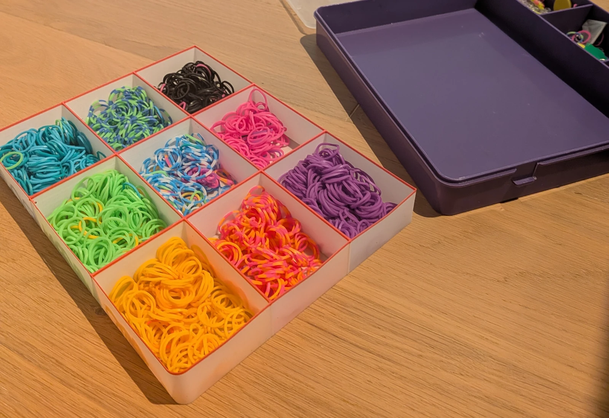
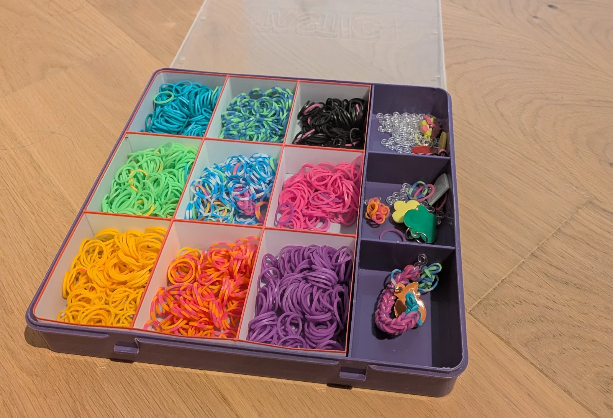

# Box Einsatz

Ich habe dieses Modell für eine Gummibänder-Box erstellt, damit diese besser organisiert sind.

Das Modell ist vollkommen parametrisch, sodass du es an deine Box anpassen kannst. Auch die Anzahl der Reihen und Spalten ist konfigurierbar. 

Wenn du auch einen farbigen Rand haben möchtest, kannst du bei deinem Slicer einen Filamentwechsel einstellen.

:::slideshow

:::

::openscad{src="./box-einsatz.scad" library="BOSL2"}
