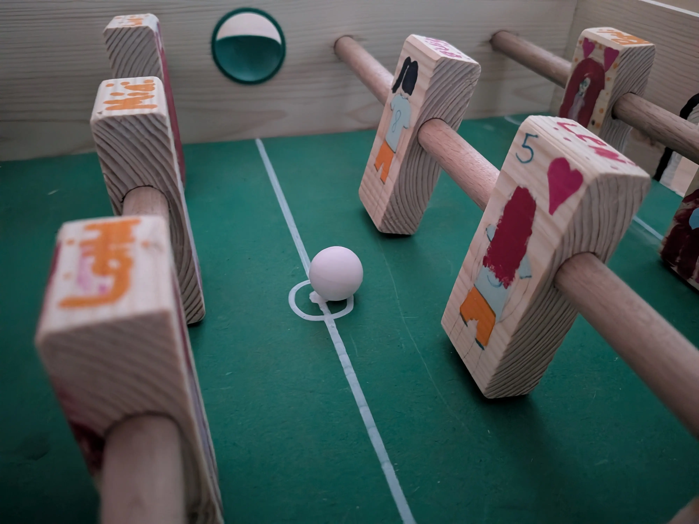
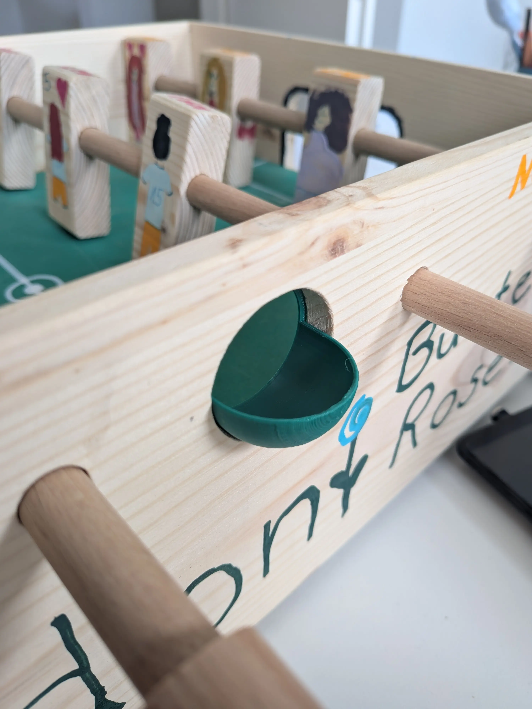
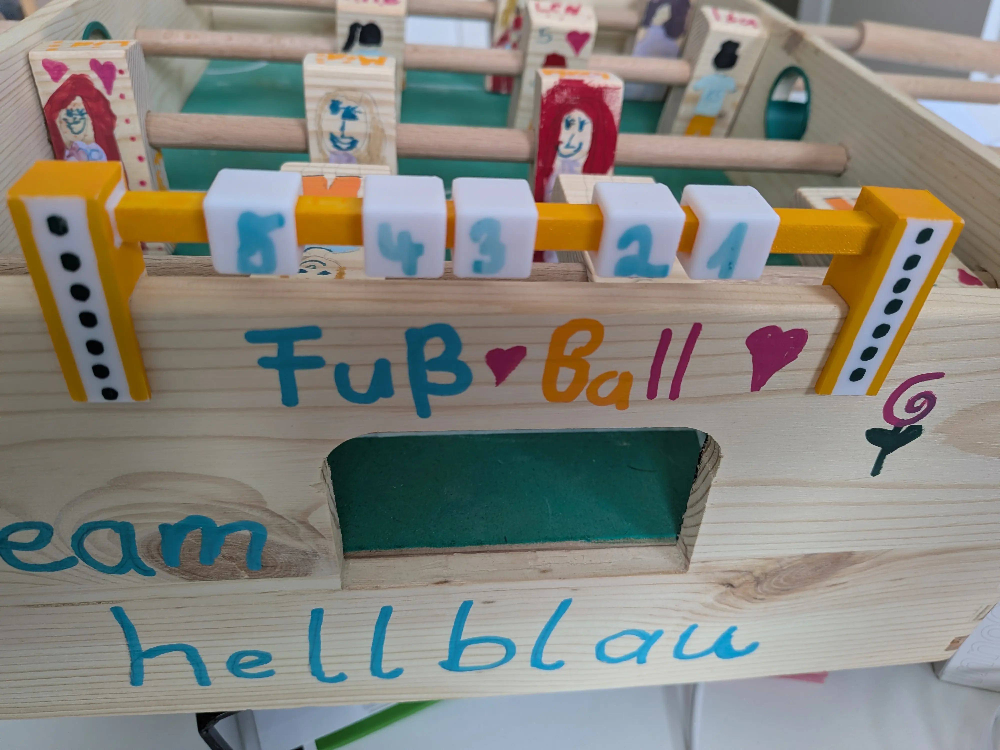

# Kicker

Hier findest du einige 3D-Modelle, die du für deinen Kicker verwenden kannst. Alle Modelle sind im OpenSCAD-Format und parameterisiert, damit du sie an deine Bedürfnisse anpassen kannst.

:::slideshow

:::

::openscad{library="BOSL2" src="./ball.scad"}

::openscad{library="BOSL2" src="./entry.scad"}

::openscad{library="BOSL2" src="./score.scad"}
