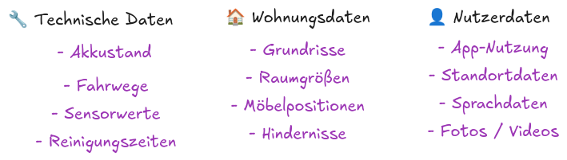

# Staubsaugerroboter und Sicherheit

Die Schüler:innen haben in den vorherigen Einheiten einen eigenen Staubsaugroboter mit LEGO Mindstorms EV3 gebaut und verschiedene Navigationsstrategien ausprobiert. Nun rücken Fragen zur Datensammlung, Privatsphäre und Sicherheit vernetzter Geräte in den Mittelpunkt.

## Ablauf

### Phase 1 – Einstieg: Was würdet ihr einbauen? (20 Min.)

Die Lehrkraft startet mit der Impulsfrage:

> „Wenn ihr euren LEGO-Staubsaugroboter verbessern dürftet – was würdet ihr einbauen?"

Die Schüler:innen sammeln Ideen (Kamera, WLAN, App-Steuerung, Sprachsteuerung, Kartierung …). Daraus leitet die Lehrkraft ab, welche **Daten** der Roboter dafür sammeln müsste (Tafelbild: Funktion → benötigte Daten). Übergang:

> „Je intelligenter ein Roboter wird, desto mehr Daten sammelt er."

### Phase 2 – Marktanalyse (25 Min.)

Gruppenarbeit (3–4 Personen). Jede Gruppe recherchiert einen Hersteller (Roborock, iRobot, Ecovacs, Dreame, DJI) anhand des **Arbeitsblatts Marktanalyse**. Vorstellung der Ergebnisse im Plenum.

### Phase 3 – Welche Daten sammelt ein Staubsaugroboter? (15 Min.)

Lehrervortrag mit Schülerbeteiligung. Die Lehrkraft strukturiert die mögliche Datensammlung (technische Daten, Wohnungsdaten, Nutzerdaten, Kameradaten). Tafelimpuls:

> „Welche dieser Daten würdet ihr Fremden freiwillig geben?"

### Phase 4 – Videoanalyse: DJI-Sicherheitslücke (25 Min.)

Die Schüler:innen sehen ein Video über die DJI-Sicherheitslücke (MQTT-Problem) und bearbeiten während des Schauens das **Arbeitsblatt Videoanalyse**.

::youtube{#U5R3Iv2IFWE}

### Phase 5 – Auswertung Video (15 Min.)

Gemeinsame Sicherung im Plenum. Kernaussagen werden herausgearbeitet:
- Was war das eigentliche Problem? (fehlende Zugriffskontrolle, nicht die Verschlüsselung)
- Erklärung des Analogie-Vergleichs (Lehrerzimmer mit gleichem Schlüssel für alle)

### Phase 6 – BSI als Verbraucherberater (20 Min.)

Gruppen erhalten das **Arbeitsblatt BSI-Empfehlungen**. Arbeitsauftrag: Welche drei Fragen sind die wichtigsten? Anschließend Diskussion im Plenum.

### Phase 7 – Kaufberatung: Datenschutz-Check (25 Min.)

Gruppenarbeit mit dem **Arbeitsblatt Datenschutz-Check**. Jede Gruppe entwickelt ein Bewertungsraster und bewertet den eigenen recherchierten Roboter. Vorstellung der Ergebnisse.

### Phase 8 – Debatte (20 Min.)

**These:** „Staubsaugroboter mit Kamera sollten verboten werden."

Raumlinie: Die Schüler:innen positionieren sich physisch im Raum und begründen ihre Haltung.

### Phase 9 – Abschlussprodukt (15 Min.)

Jede Gruppe erstellt ein Verbraucherplakat „Der sichere Staubsaugroboter" mit:
- sinnvollen Funktionen
- gesammelten Daten
- Worauf man achten sollte
- drei Kaufempfehlungen nach BSI

## Material

### Präsentation

:::typst{mode="edit"}
::snippet{#fonts}
@source dest="main.typ" src="praesentation.typ"
:::

### Arbeitsblatt: Marktanalyse

:::typst{mode="edit"}
::snippet{#fonts}
@source dest="main.typ" src="arbeitsblatt-marktanalyse.typ"
:::

### Arbeitsblatt: Videoanalyse

:::typst{mode="edit"}
::snippet{#fonts}
@source dest="main.typ" src="arbeitsblatt-video.typ"
:::

### Arbeitsblatt: BSI-Empfehlungen

:::typst{mode="edit"}
::snippet{#fonts}
@source dest="main.typ" src="arbeitsblatt-bsi.typ"
:::

### Arbeitsblatt: Datenschutz-Check

:::typst{mode="edit"}
::snippet{#fonts}
@source dest="main.typ" src="arbeitsblatt-datenschutz-check.typ"
:::
