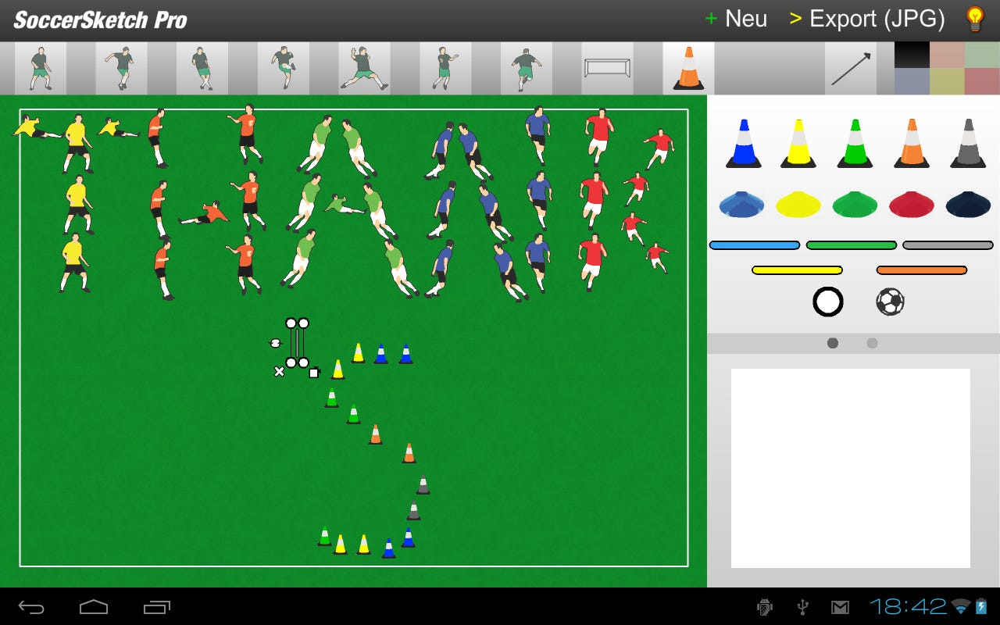
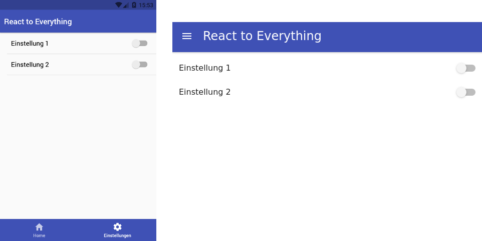
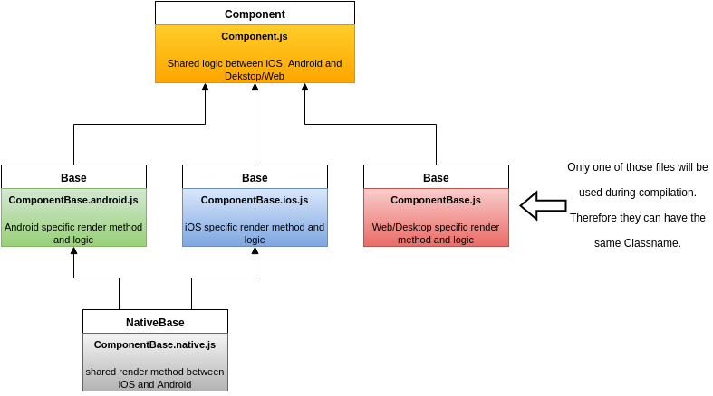

In this article I will introduce you to a project which I have developed over the last few months. It aims to share as much code possible between Android, iOS, Web and Desktop, but tries to look and act like a first class citizen.

At first, I start with a short introduction where I come from and then I will present you the project in detail. Feel free to ask me anything in the comments :) and enjoy the read.

## Everything start with a dream

It is the dream of every developer. Write your code once and run it on every device possible. This would result in less development time and costs, fewer bugs and a broader audience.

In the last years a few projects tried to make this dream come true. [Sencha Touch](https://www.sencha.com/products/touch/), [Titanium](https://www.appcelerator.com/mobile-app-development-products/) or [PhoneGap](http://phonegap.com/) just to name a few. But there was never a real competitor to native development, which was comparable performance-wise and could share much code between different platforms.

The last universal app, which I have developed was actually my first one. I developed [SoccerSketch](https://play.google.com/store/apps/details?id=air.com.mikescho.soccersketch) in 2010 with Adobe Flash CS4. It was easy to develop and could be deployed on Windows, Linux, Mac, iOS, Android and BlackBerry, which was huge to me as a newcomer in the development world, who did not know much about developing. But there was a big issue or a big benefit, it depends on how you look at it, on each platform my app looked the same and the performance varied heavy on each platform. This could also be my bad coding back then, but who knows ;) — “burns old hard drive”.

*Screenshot of SoccerSketch running on Android Honeycomb*

Now fast-forward 7 years and a few programming courses, books and projects later. I had picked up once again on this idea to write once and run everywhere. So I started a proof of concept project, which is not quite write once run everywhere, but it is close.

## The future is now

My project [react-to-everything](https://raw.githubusercontent.com/mikebarkmin/react-to-everything/) started as an idea 10 months ago. Especially the [react-native-nw-react-calculator](https://github.com/benoitvallon/react-native-nw-react-calculator) from [benoitvallon](https://github.com/benoitvallon) inspired much of my work. The core concepts derived from his ideas. I will go over the core principles of the project, but feel free to give him a star.

At first take a look at the screenshot down below. On the right-hand-side you can see a screenshot of the project running in the browser, which is also the same view you would get when running it on a desktop. On the left-hand-side you can see it running on an android device ([bottom tabs are a thing now in material design](https://material.io/guidelines/components/bottom-navigation.html#)). Unfortunately I can not present you an iOS screenshot, because I do not own an apple device, but believe me it would look like an iOS app.

*Left: Android, Right: Web*

### The key is to react

The ui components are developed with react and react-native. But I relay heavily on inheritance to share as much code as possible.

*Diagram of the connection between the files. The arrow defines the direction in which the code is pumped.*

So every component which I have used in this project consists of five files. At first this sound like chaos, but let me explain. We have three base classes. One for Android (*.android.js), one for iOS (*.ios.js) and one for the Web/Desktop (*.js). These files contain platform specific code, but Android and iOS relay on the class NativeBase (*.native.js), which could be used to only write code for mobile, but not for the Web/Desktop.

For the Header component which you can see in the screenshot following code is used for Android/iOS and for Web/Desktop:

HeaderBase.native.js

```react
    import React from 'react';
    import { Header, Title, Body } from 'native-base';

    import I18n from '../../locales/I18n';

    export default class NativeBase extends React.Component {
      render() {
        return (
          <Header>
            <Body>
              <Title>
                {I18n.t('reactToEverything')}
              </Title>
            </Body>
          </Header>
        );
      }
    }
```

HeaderBase.js

```react
    import React from 'react';
    import AppBar from 'material-ui/AppBar';
    import { connect } from 'react-redux';

    import I18n from '../../locales/I18n';
    import { toggleDrawer } from '../../actions/navigationActions';

    @connect()
    export default class Base extends React.Component {
      constructor(props) {
        super(props);
        this.handleToggle = this.handleToggle.bind(this);
      }
      handleToggle() {
        this.props.dispatch(toggleDrawer());
      }
      render() {
        return (
          <AppBar
              onLeftIconButtonTouchTap={this.handleToggle}
              title={I18n.t('reactToEverything')}
          />
        );
      }
    }
```

As you can see the is a little more going on in the Web/Desktop specific code due to the navigation thought a drawer.

### Redux to the rescue

To abstract the data flow of the app I have found that [redux](http://redux.js.org/) is a great tool for that. You have seen a small example of how redux is implemented in my app above. A much better example of the integration is the settings screen:

SettingsBase.native.js

```react
    import React from 'react';
    import { Content, Text, ListItem, Left, Right, Switch } from 'native-base';

    import I18n from '../../locales/I18n';

    export default class NativeBase extends React.Component {
      render() {
        return (
          <Content>
            <ListItem>
              <Left><Text>{I18n.t('settings.settings1')}</Text></Left>
              <Right>
                <Switch
                    onValueChange={value => this.onSettings1Change(value)}
                    value={this.props.settings.settings1}
                />
              </Right>
            </ListItem>
            <ListItem>
              <Left><Text>{I18n.t('settings.settings2')}</Text></Left>
              <Right>
                <Switch
                    onValueChange={value => this.onSettings2Change(value)}
                    value={this.props.settings.settings2}
                />
              </Right>
            </ListItem>
          </Content>
        );
      }
    }
```

SettingsBase.js

```react
    import React from 'react';
    import { List, ListItem } from 'material-ui/List';
    import Toggle from 'material-ui/Toggle';

    import I18n from '../../locales/I18n';

    export default class Base extends React.Component {
      render() {
        return (
          <div>
            <List>
              <ListItem
                  primaryText={I18n.t('settings.settings1')}
                  rightToggle={
                    <Toggle
                        onToggle={(e, value) => this.onSettings1Change(value)}
                        value={this.props.settings.settings1}
                    />
                  }
              />
              <ListItem
                  primaryText={I18n.t('settings.settings2')}
                  rightToggle={
                    <Toggle
                        onToggle={(e, value) => this.onSettings2Change(value)}
                        value={this.props.settings.settings2}
                    />
                  }
              />
            </List>
          </div>
        );
      }
    }
```

As you can see, both classes using the methods onSettings1Change and onSettings2Change these are “abstract” methods with should be implemented in an inherent class. In our example:

Settings.js

```react
    import { connect } from 'react-redux';
    import Base from './SettingsBase';

    import { setSettings1, setSettings2 } from '../../actions/settingsActions';

    export class Settings extends Base {
      constructor(props) {
        super(props);
        this.onSettings1Change.bind(this);
        this.onSettings2Change.bind(this);
      }
      onSettings1Change(value) {
        this.props.dispatch(setSettings1(value));
      }
      onSettings2Change(value) {
        this.props.dispatch(setSettings2(value));
      }
    }

    function mapStateToProps(state) {
      return {
        settings: state.settings,
      };
    }

    export default connect(mapStateToProps)(Settings);
```

This class also connects to the redux state and therefore the props settings.settings1 and settings.settings2 will update when the redux state changes those.

When you follow this sample you could extract all the logic into one class and let the platform specific class as dumb as possible. They should only receive data and display it. Nothing more, nothing less.

### Localization

Thanks to the concept describe above it is also possible to share the same translations and use the same api for that throughout your whole codebase. I have use i[18n-js](https://github.com/fnando/i18n-js) and [react-native-i18n](https://github.com/AlexanderZaytsev/react-native-i18n), which resulted in following code:

I18n.js

```javascript
    import I18n from 'i18n-js';
    import de from './locales/de';
    import en from './locales/en';

    I18n.fallbacks = true;

    I18n.translations = {
      en,
      de,
    };

    I18n.locale = navigator.language || navigator.userLanguage;

    export default I18n;
```

I18n.native.js

```javascript
    import I18n from 'react-native-i18n';
    import de from './locales/de';
    import en from './locales/en';

    I18n.fallbacks = true;

    I18n.translations = {
      en,
      de,
    };

    export default I18n;
```

I18n.android.js and I18n.ios.js

```javascript
    import I18n from './I18n.native';

    export default I18n;
```

## Conclusion

It was a fun project to tinker with react, react-native, redux and the whole idea of having to write once and run everywhere. Even though the whole process of creating five files for each component is very tedious (plop is configured for automated component generation in my repository), I think it is a nice setup, which could be used to develop app that should have the same screen and the same data-flow. When you want an extra screen for Android than the whole project structure becomes a mess. Therefore, I would recommend developing a separate ui for each platform, when you create such an app. But keep using react-native ;) it is really awesome.

I hope you have enjoyed the read. What are your thoughts about write once and run everywhere? Do you have any recommendations how the project could be further improved? Let me know, every feedback is good feedback. :)

Thank you!
